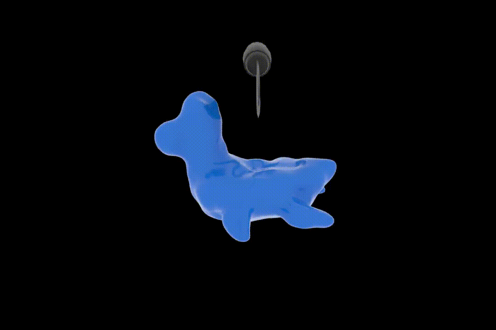
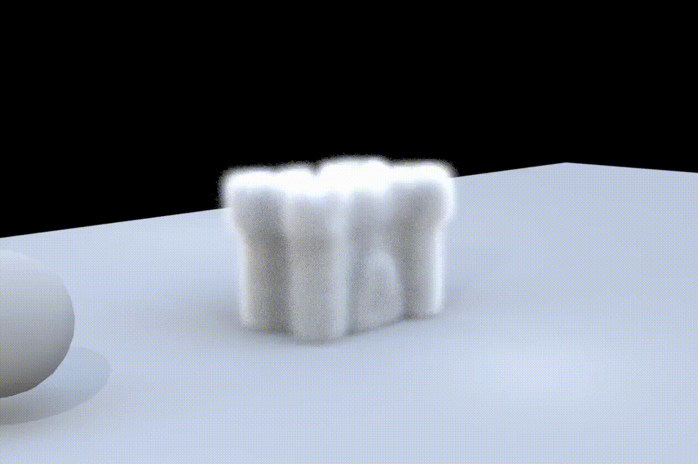
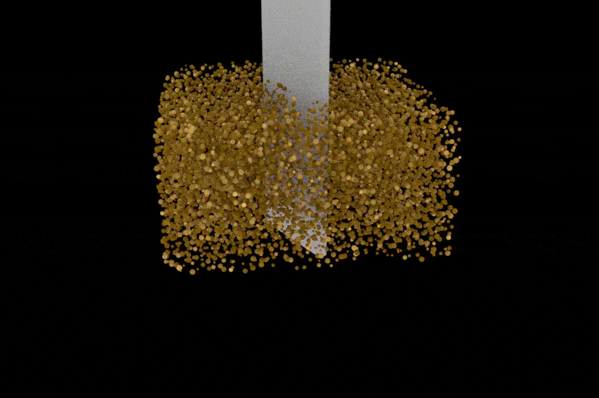

# DynamiX: Houdini Custom MPM Plugin

## Overview
The built-in MPM solver in Houdini comes with a steep learning curve, not friendly for artists new to physics simulation. We aim to develop a custom MPM solver node that simplifies this workflow.

<table>
  <tr>
    <td></td>
    <td></td>
    <td></td>
  </tr>
</table>

## Demo
<video src="img/demo.mp4" width="640" height="360" controls></video>

## CMake Build Instructions
### Preparation for building the project

#### Set up Houdini environment variables

You need to set two environment variables:  
`CUSTOM_DSO_PATH`: `C:\Users\<username>\Documents\houdini21.0\dso`  
`HOUDINI_DSO_PATH`: `%CUSTOM_DSO_PATH%;&`

#### Set up variables in CMakelists.txt

You need to set `HOUDINI_INSTALL_PATH` to the path where Houdini is installed.  
For example: `D:/Program Files/Side Effects Software/Houdini 21.0.596`.

### Building the project using CMake
Use CMake 3.24 or above to configure and generate the Visual Studio solution as follows:
1. Open the Windows command prompt window
2. In the command prompt window change to the directory where you have the CMakeLists.txt file
3. At the Windows command prompt run the command
`cmake -G "Visual Studio 17 2022" -A x64 -S .\ -B .\Build`
4. In the generated solution, build the project.

### Loading the Houdini Plugin
- Move the cursor to the lower right panel in Houdini (Network Editor) and press the Tab key
- Type "Geometry" then choose the geometry object.
- Click to place in the Network Editor window.
- Double-click the new geometry node to go into it.
- Press Tab again in the Network Editor window and type "MyMPM".
- Click to place.
