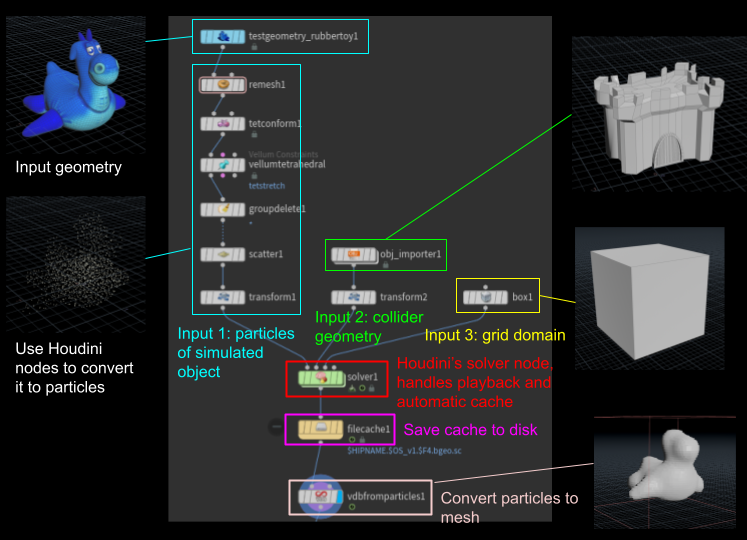

# DynamiX: Houdini Custom MPM Plugin

## Overview
The built-in MPM solver in Houdini comes with a steep learning curve, not friendly for artists new to physics simulation. We aim to develop a custom MPM solver node that simplifies this workflow.

<table>
  <tr>
    <td></td>
    <td></td>
    <td></td>
  </tr>
</table>

## Demo
<https://github.com/user-attachments/assets/591d7e13-0387-483d-a568-54489740a103>

## CMake Build Instructions
### Set up environment variables

You need to set the following environment variables:

- `CUSTOM_DSO_PATH`: `C:\Users\<username>\Documents\houdini21.0\dso`  
- `HOUDINI_DSO_PATH`: `%CUSTOM_DSO_PATH%;&`
- `HOUDINI_INSTALL_PATH`: the path where Houdini is installed.
  - For example: `D:/Program Files/Side Effects Software/Houdini 21.0.596`.

### Building the project using CMake
Use CMake 3.24 or above to configure and generate the Visual Studio solution as follows:
1. In the root directory, run the command
`cmake -G "Visual Studio 17 2022" -A x64 -S .\ -B .\Build`
2. In the generated solution, build the project.

### Loading the Houdini Plugin
- Create a Geometry node and enter.
- Add node "DynamiX MPM".

## Usage
